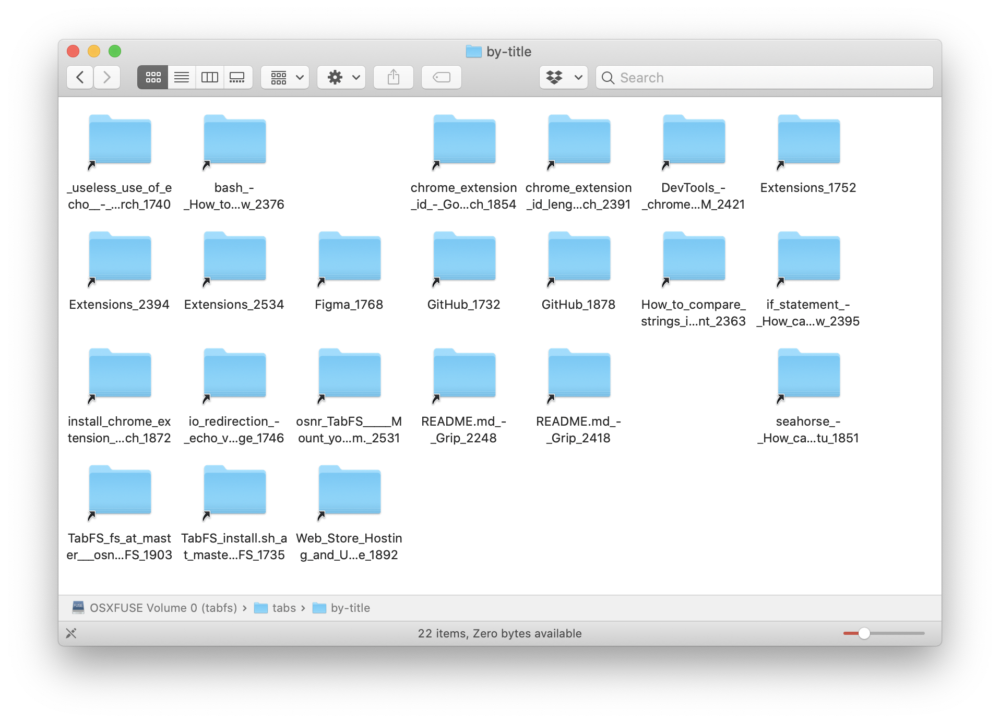
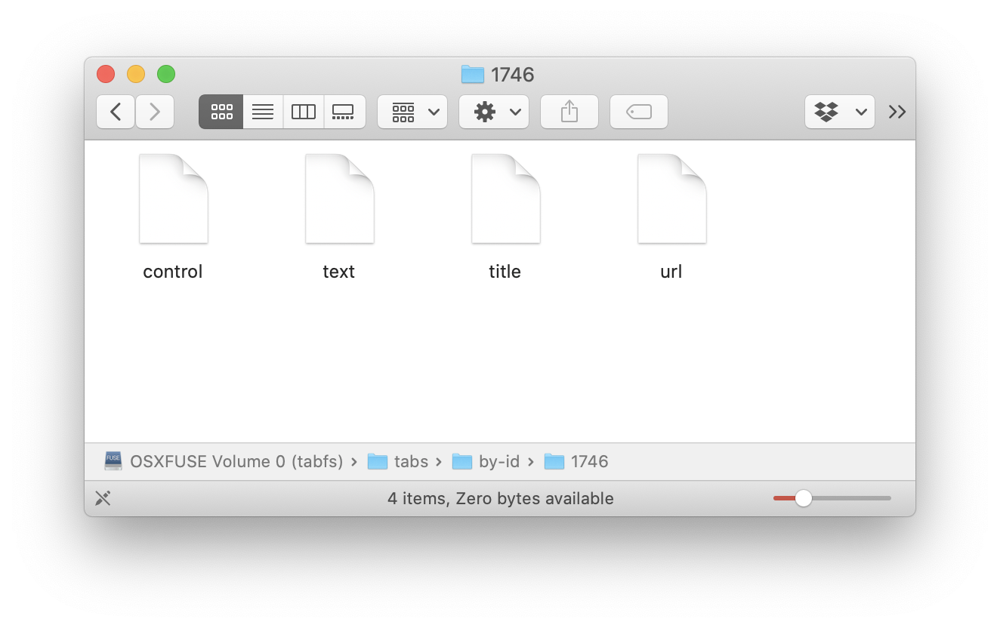

# TabFS

TabFS is a browser extension that mounts your browser tabs as a
filesystem on your computer.

Out of the box, it supports Chrome and (to a lesser extent) Firefox,
on macOS and Linux; it could probably be made to work on other
browsers like Safari and Opera that support the WebExtensions API, but
I haven't looked into it.



Each of your open tabs is mapped to a folder with a bunch of files
inside it. These files directly reflect (and can control) the state of
that tab. (TODO: update as I add more)



This gives you a _ton_ of power, because now you can apply [all the
existing tools](https://twitter.com/rsnous/status/1018570020324962305)
on your computer that already know how to deal with files -- terminal
commands, scripting languages, etc -- and use them to control and draw
information out of your browser. You don't need to code up a browser
extension from scratch every time you want to do anything.

## Examples of stuff you can do!

(assuming your shell is in the `fs` subdirectory of this repo)

(TODO: more of these)

### List the titles of all the tabs you have open 

```
$ cat mnt/tabs/by-id/*/title
GitHub
Extensions
TabFS/install.sh at master · osnr/TabFS
Alternative Extension Distribution Options - Google Chrome
Web Store Hosting and Updating - Google Chrome
Home / Twitter
...
```

### Close all Stack Overflow tabs

```
$ rm mnt/tabs/by-title/*Stack_Overflow*
```

or (older)

```
$ echo remove | tee -a mnt/tabs/by-title/*Stack_Overflow*/control
```

### Save text of all tabs to a file

```
$ cat mnt/tabs/by-id/*/text > text.txt
```

### TODO: Reload an extension when you edit its source code

Making another extension?

SO post.

We can subsume that.

### TODO: Manage tabs in Emacs dired

I do this

### TODO: Live edit


### TODO: Something with live view of variables


## Setup

**disclaimer**: security, functionality, blah blah. applications may
freeze ... In some sense, the whole point of this extension is to
create a gigantic new surface area of communication between stuff
inside your browser and software on the rest of your computer.

First, install the browser extension.

Then, install the C filesystem.

### 1. Install the browser extension

(I think for Opera or whatever other Chromium-based browser, you could
get it to work, but you'd need to change the native messaging path in
install.sh. Not sure about Safari. maybe Edge too? if you also got
everything to compile for Windows)

#### in Chrome

Go to the [Chrome extensions page](chrome://extensions). Enable
Developer mode (top-right corner).

Load-unpacked the `extension/` folder in this repo.

**Make a note of the extension ID Chrome assigns.** Mine is
`jimpolemfaeckpjijgapgkmolankohgj`. We'll use this later.

#### in Firefox

You'll need to install as a "temporary extension", so it'll only last
in your current FF session.

Go to [about:debugging#/runtime/this-firefox](about:debugging#/runtime/this-firefox).

Load Temporary Add-on...

Choose manifest.json in the extension subfolder of this repo.

### 2. Install the C filesystem

First, make sure you `git submodule update --init` to get the
`fs/cJSON` and `fs/base64` dependencies.

And make sure you have FUSE. On Linux, for example, `sudo apt install
libfuse-dev`. On macOS, get FUSE for macOS.

```
$ cd fs
$ mkdir mnt
$ make
```

Now install the native messaging host into your browser, so the
extension can launch and talk to the filesystem:

#### Chrome and Chromium

Substitute the extension ID you copied earlier for
`jimpolemfaeckpjijgapgkmolankohgj` in the command below.

```
$ ./install.sh chrome jimpolemfaeckpjijgapgkmolankohgj
```

or

```
$ ./install.sh chromium jimpolemfaeckpjijgapgkmolankohgj
```

### 3. Ready!

Go back to `chrome://extensions` or
`about:debugging#/runtime/this-firefox` and reload the extension.

Now your browser tabs should be mounted in `fs/mnt`!

Open the background page inspector to see the filesystem operations
stream in. (in Chrome, click "background page" next to "Inspect views"
in the extension's entry in the Chrome extensions page; in Firefox,
click "Inspect")


This console is also incredibly helpful for debugging anything that
goes wrong, which probably will happen.

(My OS and applications are pretty chatty! They do a lot of
operations, even when I don't feel like I'm actually doing anything.)

## Design

- `fs/`: Native FUSE filesystem, written in C
  - [`tabfs.c`](fs/tabfs.c): Talks to FUSE, implements fs operations, talks to extension.
- `extension/`: Browser extension, written in JS
  - [`background.js`](extension/background.js): **The most interesting
    file**. Defines all the synthetic files and what browser
    operations they invoke behind the scenes.

<!-- TODO: concretize this -->

When you, say, `cat` a file in the tab filesystem:

1. `cat` makes something like a `read` syscall,

2. which goes to the FUSE kernel module which backs that filesystem,

3. FUSE forwards it to the `tabfs_read` implementation in our
   userspace filesystem in `fs/tabfs.c`,

4. then `tabfs_read` rephrases the request as a JSON string and
   forwards it to the browser extension over 'native messaging',

6. our browser extension in `extension/background.js` handles the
   incoming message and calls the browser APIs to construct the data
   for that synthetic file;

7. then the data gets sent back in a JSON native message to `tabfs.c`
   and and finally back to FUSE and the kernel and `cat`.

(very little actual work happened here, tbh. it's all just
marshalling)

TODO: make diagrams?

## license

GPLv3

## hmm

processes as files. the real process is the browser. 

browser and Unix; the two operating systems

it's way too hard to make an extension. even 'make an extension' is a
bad framing; it suggests making an extension is a whole Thing, a whole
Project. like, why can't I just take a minute to ask my browser a
question or tell it to automate something? lightness

open input space -- filesystem

now you have this whole 'language', this whole toolset, to control and
automate your browser. there's this built-up existing capital where
lots of people already know the operations to work with files

this project is cool bc i immediately get a dataset i care about

OSQuery

fake filesystems talk

Screenotate

rmdir a non-empty directory

do you like setting up sockets? I don't
